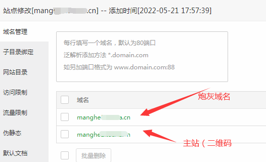
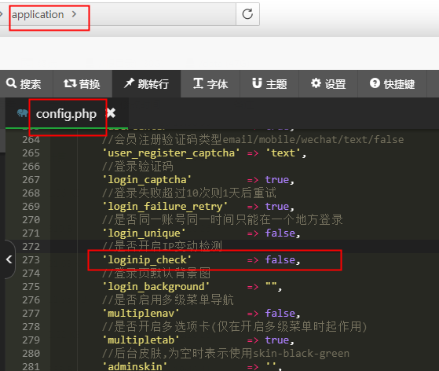
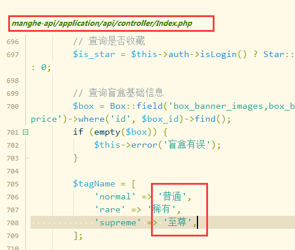
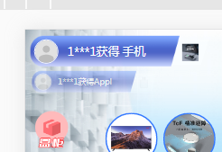


H5盲盒系统安装使用教程

**本人服务仅供研究学习交流使用，请勿用于非法违法违规用途，如出现任何法律纠纷或从事违法违规活动与本人无关!**

**后台使用教程：**

环境：php7.1以上，一定要linux cenost7安装宝塔Nginx，php管理那里删除掉禁用函数putenv，安装Redis扩展，然后重启php服务！

创建网站，上传后端压缩包源码到目录解压，设置运行目录：

设置伪静态：伪静态设置为thinkphp（不配置伪静态会h5页面没有数据）

将数据库.sql文件导入数据库

修改数据库连接信息文件.env

后台地址：网址/mhsc.php 用户admin 密码123456

注意盲盒3.0不要搞HTTPS证书了，有炮灰功能会冲突，要搞只能搞炮灰的https，二维码主站不要搞。

**前端配置方式：** 

前端打包配置：

下载hbuilder软件，<https://www.dcloud.io/>

导入解压好的前端文件夹

搜索盲盒商城改成你的网站名称

修改manifest.json

修改main.js网址

重新获取appid

然后发行至PC或H5

将H5里面的文件上传网站/public/H5/目录进行替换

后台设置：

后台默认地址：网址/mhsc.php 用户admin 密码123456

**后台插件中心是后台FastAdmin开源框架自带的，不代表网站，大部分为半成品无对接，请勿自行购买安装。**

**短信、支付、登录安装配置请参考下面教程为准。**

**炮灰域名设置：**

**在宝塔网站管理那里增加一个炮灰域名的绑定**

后台设置域名：

把http://你的二维码主站.cn/h5/#/pages/index/redirect  这个链接在草料二维码平台上生成一个你的二维码，以后就用这个二维码发给用户或者代理，就会跳转到炮灰，二维码主站域名和网址不要发给别人，避免被封。

如果炮灰被封了后只需要替换后台的炮灰域名，增加宝塔网站的炮灰绑定。

注意事项：

**1.如果要配置CDN加速**，/application/config.php 第273行设置false

不然后台会登录不上

注意事项：

VUE的H5项目是存在缓存的，会出现H5界面没有及时更新

h5项目（特别是vue）缓存严重的解决方案，配合nginx

宝塔管理nginx上设置:

默认情况下使用nginx作为h5静态资源的服务器时，这些资源在浏览器端是会有缓存的，特别是微信浏览器中，缓存非常严重。

所以项目开始部署阶段就需要配置好nginx禁止这些资源的缓存，nginx需要做如下配置：

代码：

location / {

`    `root   html;

`    `index  index.html;

`    `add\_header Cache-Control no-cache;

}

如上配置之后，每次发布只要文件经过修改了（无视文件名），那么都会从服务端拉取最新的资源，保证项目及时更正！

非必要修改：

如果要修改至尊，稀有，普通，在前端代码修改：（这个百分百仅为展示作用，具体以商品概率为准）

后端修改：

这个页面有两处：

尊敬的各位用户你好：

现在目前盲盒程序用的是阿里云oss储存，为了不影响你的使用建议您更换成你自己的储存。

储存默认的是阿里云路径：application\admin\controller\Ajax.php

还有：左上角的是需要有人开奖自动出来的

